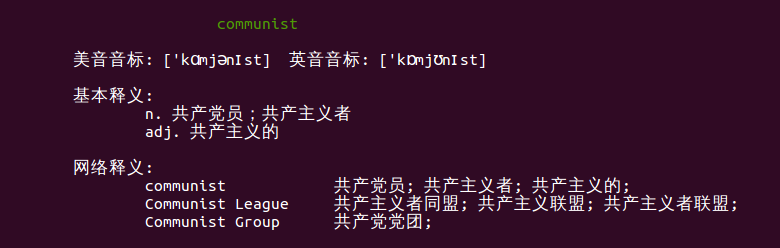
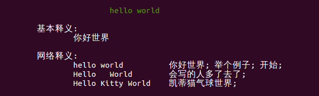
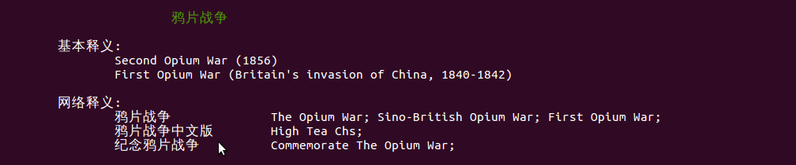

# pydict

在命令行下使用的英/汉、汉/英字典

## 安装

```bash
$ git clone https://github.com/np-csu/pydict.git
$ cd pydict
$ python setup.py install
$ cd bin
$ ln dict ~/bin/
```

## 如何使用

```bash
$ dict [要查询的单词或句子]
```

## 运行效果




